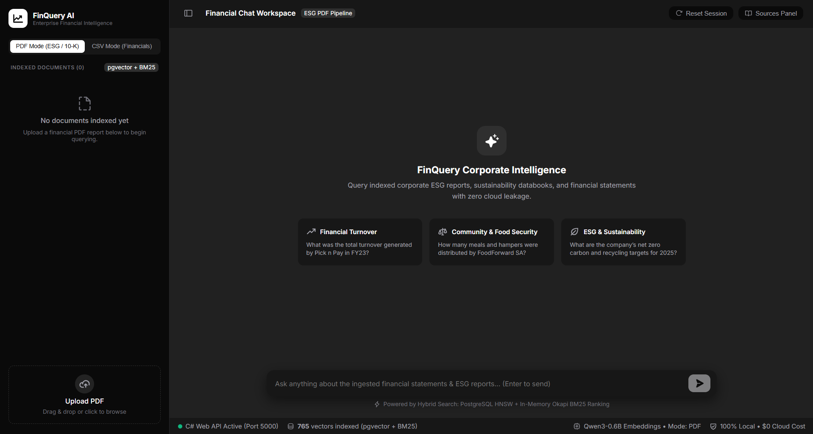
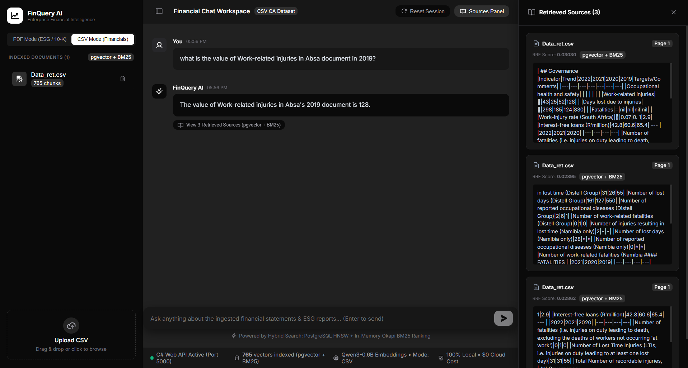
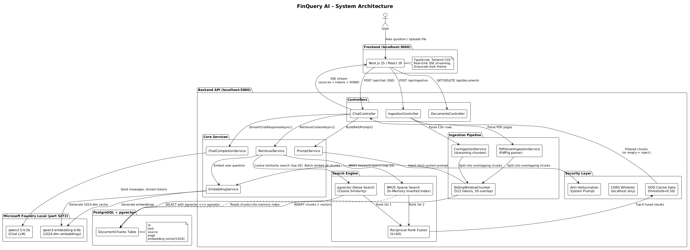

# FinQuery AI

> A fully offline, enterprise-grade Retrieval-Augmented Generation (RAG) assistant for financial and ESG document analysis. No cloud. No API keys. No data leaves your machine.

---

## Screenshots

### Chat Interface

*The main chat window -- ask any financial question and get a streamed, sourced answer in real time.*

### Retrieved Sources Panel

*Every answer is backed by cited sources -- showing the exact document name, page number, and relevance score of each retrieved chunk.*

---

## Purpose and Motivation

Most large language models (LLMs) suffer from a critical weakness in enterprise settings: **hallucination**. A standard LLM, when asked *"What was Pick n Pay's total turnover in FY23?"*, will confidently fabricate a number if it does not know the answer. This is catastrophic for financial analysis.

**FinQuery AI** solves this by implementing the **Retrieval-Augmented Generation (RAG)** pattern. Instead of relying on the model's internal, potentially stale, training data, the system:

1. Ingests your private financial documents (annual reports, ESG reports, CSV exports).
2. Converts them into semantic vector representations stored in a local database.
3. At query time, retrieves only the most relevant passages from *your* documents.
4. Passes those passages to the LLM as grounded context, instructing it to answer *only* from what was provided.

This makes FinQuery AI fundamentally different from asking a question to a raw LLM:

| Feature | Raw LLM (e.g. ChatGPT) | FinQuery AI |
|---|---|---|
| Knowledge Source | Training data (cutoff date) | Your private documents |
| Hallucination Risk | High | Minimal (grounded answers only) |
| Data Privacy | Cloud-based | 100% local, offline |
| Citeable Sources | No | Yes (document + page number) |
| Up-to-date with your data | No | Yes (ingest new files anytime) |
| Internet Required | Yes | No |

---

## System Architecture

The system follows a layered architecture where each component has a single responsibility:

```
User Browser (localhost:3000)
        |
        | HTTP Request / Server-Sent Events (SSE) Stream
        v
C# ASP.NET Core Web API (localhost:5000)
   |-- ChatController        (accepts questions, streams answers via SSE)
   |-- IngestionController   (handles PDF/CSV upload and processing)
   |-- DocumentsController   (lists/deletes indexed documents)
   |-- RetrievalService      (orchestrates hybrid search + RRF fusion)
   |-- ChatCompletionService (sends prompt to LLM, streams tokens)
   |-- PromptService         (builds the RAG prompt with context injection)
   |-- EmbeddingService      (generates 1024-dim vectors via qwen3-embedding)
   |-- Bm25Index             (in-memory inverted index for keyword search)
        |
        v
PostgreSQL + pgvector        (stores document chunks + embedding vectors)
        |
        v
Microsoft Foundry Local      (local model inference engine on port 5272)
   |-- qwen2.5-0.5b          (chat completion / LLM)
   |-- qwen3-embedding-0.6b  (text embeddings, 1024 dimensions)
```


### Architecture Diagram



<details>
<summary>PlantUML Source Code (click to expand)</summary>

@startuml FinQuery_Architecture
!theme plain
skinparam backgroundColor white
skinparam defaultFontName Inter
skinparam componentStyle rectangle

title FinQuery AI - System Architecture

actor "User" as user

package "Frontend (localhost:3000)" {
  [Next.js 15 / React 19] as frontend
  note right of frontend
    TypeScript, Tailwind CSS
    Real-time SSE streaming
    Grayscale dark theme
  end note
}

package "Backend API (localhost:5000)" {
  package "Controllers" {
    [ChatController] as chat_ctrl
    [IngestionController] as ingest_ctrl
    [DocumentsController] as docs_ctrl
  }

  package "Core Services" {
    [RetrievalService] as retrieval
    [ChatCompletionService] as chat_svc
    [PromptService] as prompt_svc
    [EmbeddingService] as embed_svc
  }

  package "Search Engine" {
    [pgvector Dense Search\n(Cosine Similarity)] as dense
    [BM25 Sparse Search\n(In-Memory Inverted Index)] as sparse
    [Reciprocal Rank Fusion\n(k=60)] as rrf
  }

  package "Security Layer" {
    [OOD Cosine Gate\n(threshold=0.50)] as ood_gate
    [CORS Whitelist\n(localhost only)] as cors
    [Anti-Hallucination\nSystem Prompt] as anti_halluc
  }

  package "Ingestion Pipeline" {
    [PdfVisionIngestionService\n(PdfPig parser)] as pdf_ingest
    [CsvIngestionService\n(streaming chunker)] as csv_ingest
    [SlidingWindowChunker\n(512 tokens, 50 overlap)] as chunker
  }
}

database "PostgreSQL + pgvector" as db {
  [DocumentChunks Table\n(id, text, source, page,\nembedding vector[1024])]
}

package "Microsoft Foundry Local (port 5272)" {
  [qwen2.5-0.5b\n(Chat LLM)] as llm
  [qwen3-embedding-0.6b\n(1024-dim embeddings)] as embed_model
}

user --> frontend : Asks question / Uploads file
frontend --> chat_ctrl : POST /api/chat (SSE)
frontend --> ingest_ctrl : POST /api/ingestion
frontend --> docs_ctrl : GET/DELETE /api/documents

chat_ctrl --> retrieval : RetrieveContextAsync()
retrieval --> embed_svc : Embed user question
embed_svc --> embed_model : Generate 1024-dim vector
retrieval --> dense : Cosine similarity search (top 20)
retrieval --> sparse : BM25 keyword search (top 20)
dense --> db : SELECT with pgvector <=> operator
sparse ..> db : Reads chunks into memory index
dense --> rrf : Rank list 1
sparse --> rrf : Rank list 2
rrf --> ood_gate : Top-K fused results
ood_gate --> chat_ctrl : Filtered chunks (or empty = reject)

chat_ctrl --> prompt_svc : BuildRAGPrompt()
prompt_svc --> anti_halluc : Inject strict system prompt
chat_ctrl --> chat_svc : StreamChatResponseAsync()
chat_svc --> llm : Send messages, stream tokens
chat_ctrl --> frontend : SSE stream (sources + tokens + DONE)

ingest_ctrl --> pdf_ingest : Parse PDF pages
ingest_ctrl --> csv_ingest : Parse CSV rows
pdf_ingest --> chunker : Split into overlapping chunks
csv_ingest --> chunker : Split into overlapping chunks
chunker --> embed_svc : Batch embed all chunks
embed_svc --> embed_model : Generate embeddings
chunker --> db : INSERT chunks + vectors

@enduml
```

</details>

---

## Core Algorithms Explained

### 1. Text Chunking

When a PDF or CSV is uploaded, it cannot be sent to the LLM as a whole -- models have limited context windows. The system uses a **Sliding Window Chunker** that splits documents into overlapping chunks (512 tokens with a 50-token overlap). Overlap ensures that sentences at chunk boundaries are not cut off and lose their meaning.

See: [SlidingWindowChunker.cs](FinQuery.Api/Services/Ingestion/SlidingWindowChunker.cs)

### 2. Vector Embeddings -- Dense Search via pgvector

Each text chunk is converted into a **vector embedding** -- a list of **1024 floating-point numbers** -- using the `qwen3-embedding-0.6b` model running locally via Microsoft Foundry Local. This vector captures the *semantic meaning* of the text.

When a user asks a question, the question is also embedded into a vector. The system then performs a **cosine similarity search** in PostgreSQL using the `pgvector` extension to find the chunks whose meaning is closest to the question.

```
similarity = cos(theta) = (A . B) / (|A| x |B|)
```

**Strength:** Captures meaning. *"How much money did the company make?"* will find chunks about *"revenue"* and *"turnover"* even if those exact words are not in the question.

**Weakness:** Can miss exact keyword matches -- if you search for a specific product code or number, semantic search may rank irrelevant documents higher.

See: [EmbeddingService.cs](FinQuery.Api/Services/EmbeddingService.cs)

### 3. BM25 -- Sparse Keyword Search

**BM25 (Best Match 25)** is the gold-standard keyword ranking algorithm used by search engines like Elasticsearch. It is a sophisticated improvement over classic TF-IDF.

The core formula for scoring a document `D` against a query `Q`:

```
Score(D, Q) = SUM[ IDF(qi) x ( f(qi,D) x (k1+1) ) / ( f(qi,D) + k1 x (1 - b + b x |D|/avgdl) ) ]
```

Where:
- `f(qi, D)` = frequency of query term `qi` in document `D`
- `|D|` = length of document `D`
- `avgdl` = average document length in the collection
- `k1 = 1.2` = term frequency saturation (stops common words from dominating)
- `b = 0.75` = length normalization (penalizes unusually long documents)
- `IDF(qi)` = Inverse Document Frequency -- rare, specific terms score much higher than common ones

The BM25 index is built **entirely in-memory** from C# using optimized hash tables with pre-sized capacities for minimal re-hashing overhead.

**Strength:** Extremely precise for exact keyword matches, financial figures like `"R106.6 billion"`, ticker symbols, and product codes.

**Weakness:** Cannot understand semantic meaning. *"revenue"* and *"turnover"* are treated as completely unrelated terms.

See: [Bm25Index.cs](FinQuery.Api/Services/Search/Bm25Index.cs)

### 4. Reciprocal Rank Fusion (RRF) -- Hybrid Merging

Since each search method has complementary strengths and weaknesses, FinQuery uses both and merges the results using **Reciprocal Rank Fusion (RRF)**:

```
RRF_score(d) = SUM[ 1 / (k + rank(d)) ]     where k = 60
```

Where `k = 60` (a smoothing constant) and `rank(d)` is the document's position in a given result list.

A chunk that ranks **#1 in dense search AND #2 in BM25** accumulates a very high combined RRF score, while chunks that only appear in one list get a lower combined score. This reliably surfaces the most relevant context regardless of the query type.

**Result:** Hybrid search consistently outperforms either method alone on mixed financial documents that combine structured numerical data with narrative prose.

See: [RetrievalService.cs](FinQuery.Api/Services/RetrievalService.cs)

---

## Security and Robustness

FinQuery AI is designed for **financial data** -- an environment where data privacy and answer accuracy are non-negotiable. The following security measures are built into the system:

### Zero Data Leakage (100% Offline)
- All LLM inference runs locally via Microsoft Foundry Local. No API calls to OpenAI, Google, or any cloud provider.
- All document embeddings are generated and stored locally in PostgreSQL.
- The system requires **zero internet connectivity** after initial model download.

### Out-of-Domain (OOD) Gate
The retrieval layer includes a **cosine similarity gate** with a threshold of `0.50`. Before any retrieved chunks are sent to the LLM, the system checks whether the top result's raw cosine similarity exceeds this threshold:
- If cosine >= 0.50: The question is considered on-domain, and the LLM receives the context.
- If cosine < 0.50: The question is considered off-topic (e.g., "How to make cheesecake?"), and the system immediately returns: *"This information is not present in the local financial dataset."* -- **without ever calling the LLM.**

This prevents the model from being tricked into generating answers about topics outside the financial dataset.

See: [RetrievalService.cs](FinQuery.Api/Services/RetrievalService.cs) (lines 100-116)

### Anti-Hallucination System Prompt
The LLM receives a strict system prompt that enforces grounded responses:
- *"You MUST only answer using facts found inside the context tags. Do not use any knowledge from your training data."*
- *"If the question cannot be answered from the context, you MUST output exactly: 'This information is not present in the local financial dataset.'"*

This two-layer defense (OOD gate + system prompt) makes hallucination extremely unlikely.

See: [PromptService.cs](FinQuery.Api/Services/PromptService.cs)

### CORS Whitelist
The API only accepts requests from `localhost:3000` and `localhost:3001` via a strict CORS policy. No external origins are allowed.

See: [Program.cs](FinQuery.Api/Program.cs) (lines 14-23)

### Fallback RAG Response
If the Foundry Local LLM is unavailable (e.g., still downloading), the system falls back to a **deterministic fallback** that returns the top retrieved chunk verbatim with its source citation, rather than generating an ungrounded response.

---

## Tech Stack

| Layer | Technology |
|---|---|
| Frontend | Next.js 15, React 19, TypeScript |
| Backend | C# ASP.NET Core 8 Web API |
| Database | PostgreSQL 16 + pgvector extension |
| LLM Engine | Microsoft Foundry Local (local inference) |
| Chat Model | qwen2.5-0.5b |
| Embedding Model | qwen3-embedding-0.6b (1024 dimensions) |
| Keyword Search | Custom BM25 inverted index (in-memory, C#) |
| Dense Search | pgvector cosine similarity |
| Result Fusion | Reciprocal Rank Fusion (RRF, k=60) |
| PDF Parsing | PdfPig (C# library) |
| Streaming | Server-Sent Events (SSE) |
| Evaluation | DeepEval + Local LLM Judge |

---

## Prerequisites

Before you begin, ensure you have the following installed:

1. **Docker Desktop** -- To run the PostgreSQL + pgvector container. [Download here](https://www.docker.com/products/docker-desktop/).
2. **Microsoft Foundry Local** -- To run LLMs locally. [Documentation](https://learn.microsoft.com/en-us/azure/foundry-local/).
3. **.NET 8 SDK** -- To build the C# backend. [Download here](https://dotnet.microsoft.com/download).
4. **Node.js v18+** -- To run the Next.js frontend. [Download here](https://nodejs.org).

---

## Getting Started

### Step 1: Start the Database

Run the PostgreSQL + pgvector container with Docker:

```bash
docker run -d --name pgvector-db -e POSTGRES_USER=postgres -e POSTGRES_PASSWORD=YOUR_PASSWORD -e POSTGRES_DB=finquery -p 5432:5432 pgvector/pgvector:pg16
```

Then update the connection string in `FinQuery.Api/appsettings.json` with your chosen password.

### Step 2: Install Microsoft Foundry Local

Follow the [official installation guide](https://learn.microsoft.com/en-us/azure/foundry-local/how-to/how-to-install-foundry-local). The required models (`qwen2.5-0.5b` and `qwen3-embedding-0.6b`) will be downloaded automatically on first run.

### Step 3: Start the C# Backend API

```bash
cd FinQuery.Api
dotnet run
```

The API will be available at `http://localhost:5000`. The backend will automatically create the database schema and enable the pgvector extension on first run.

### Step 4: Start the Next.js Frontend

```bash
cd finquery-ui
npm install
npm run dev
```

The UI will be available at `http://localhost:3000`.

---

## Usage

1. Open `http://localhost:3000` in your browser.
2. In the **left sidebar**, select **PDF Mode** or **CSV Mode**.
3. Upload your financial documents (annual reports, ESG reports, data exports). The ingestion progress bar will show chunking and embedding in real time.
4. Type a financial question in the chat input, for example:
   - *"What was Pick n Pay's total turnover in FY23?"*
   - *"Summarize FoodForward SA's ESG impact metrics."*
   - *"What are the company's net zero carbon targets for 2025?"*
5. Watch the answer stream in real time, with **cited sources** (document name + page number) automatically appended.

---

## Evaluation Suite

A DeepEval benchmarking suite is included in `finquery-eval/`. It tests three RAG-specific quality metrics using a local LLM as the judge:

| Metric | What It Measures |
|---|---|
| **Answer Relevancy** | Is the answer relevant to the question asked? |
| **Faithfulness** | Is every claim in the answer supported by the retrieved context? |
| **Contextual Precision** | Are the most relevant chunks ranked at the top of the retrieval results? |

> **Note:** Using a small local model as a judge is extremely resource-intensive. Budget approximately 15-25 minutes per run on consumer hardware.

```bash
cd finquery-eval
pip install -r requirements.txt
pip install "portalocker[win32]"
deepeval test run test_rag.py
```

---

## Future Improvements

This project was built in approximately one month as a learning exercise. Several meaningful improvements could take it to a production-ready state:

### High Priority
- [ ] **Multi-turn Conversation Memory**: Each question is currently independent. A conversation history buffer would enable follow-up questions like *"What about the year before?"*.
- [ ] **Re-Ranker Model**: Add a cross-encoder re-ranker (e.g., bge-reranker-v2-m3) as a third ranking stage after RRF for even higher retrieval precision.
- [ ] **Larger Chat Model**: Upgrade from qwen2.5-0.5b to a larger model (e.g., qwen2.5-7b or phi-3-mini) for more accurate table parsing and reasoning.

### Medium Priority
- [ ] **Multi-Document Sessions**: Allow users to tag documents into named projects and switch between knowledge bases.
- [ ] **OCR Support**: Add Optical Character Recognition via Tesseract for scanned PDFs, since PdfPig only handles text-layer PDFs.
- [ ] **Metadata Filtering**: Filter retrieved chunks by document name, upload date, or custom tags before searching.
- [ ] **Export Chat as Report**: Export a conversation history as a formatted PDF or Markdown report.

### Nice to Have
- [ ] **Model Selection UI**: Switch between locally installed models from the UI without changing config files.
- [ ] **Dashboard Analytics**: A metrics page showing total documents indexed, chunks stored, average query latency, and evaluation scores.
- [ ] **Docker Compose**: Package the entire stack (API + Frontend + Postgres) into a single docker-compose.yml for one-command deployment.
- [ ] **Improved CSV Chunking**: Format CSV chunks as key-value pairs (e.g., "Column: Value") instead of raw pipe-delimited text for better LLM comprehension.

---

## License

This project was built for educational purposes as part of a one-month internship program inspired by the [Microsoft Foundry Local RAG example](https://techcommunity.microsoft.com/blog/azuredevcommunityblog/building-your-first-local-rag-application-with-foundry-local/4501968). Feel free to fork, extend, and learn from it.

---

*Built with Microsoft .NET, Next.js, PostgreSQL, and the local AI power of Microsoft Foundry Local.*